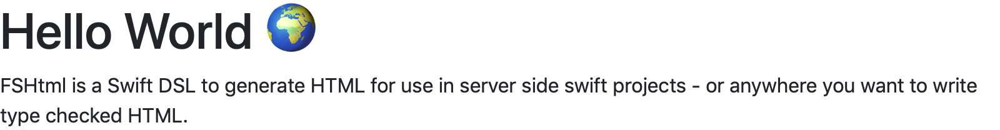

# FSHtml

FSHtml is a Swift DSL to generate HTML for use in server side swift projects - or anywhere you want to write type checked HTML.

```swift
func homePage(title: String) -> Node {
    return
        .html([.lang => "en"], [
            .head([
                .meta([.charset => "utf-8"]),
                .meta([.name => "viewport",
                    .content => "width=device-width, initial-scale=1, shrink-to-fit=no"]),
                .link([.rel => "stylesheet",
                    .href => "https://stackpath.bootstrapcdn.com/bootstrap/4.1.3/css/bootstrap.min.css",
                    .integrity => "sha384-MCw98/SFnGE8fJT3GXwEOngsV7Zt27NXFoaoApmYm81iuXoPkFOJwJ8ERdknLPMO",
                    .crossorigin => "anonymous"]),
                .title(title)
            ]),
            .body([
                .h1([.text(title)]),
                .p("FS HTML is a Swift DSL to generate HTML for use in server side swift projects - or anywhere you want to write type checked HTML.")
            ])
    ])
}

homePage("Hello World 🌍")  // -> "<!DOCTYPE HTML> ..."
```


